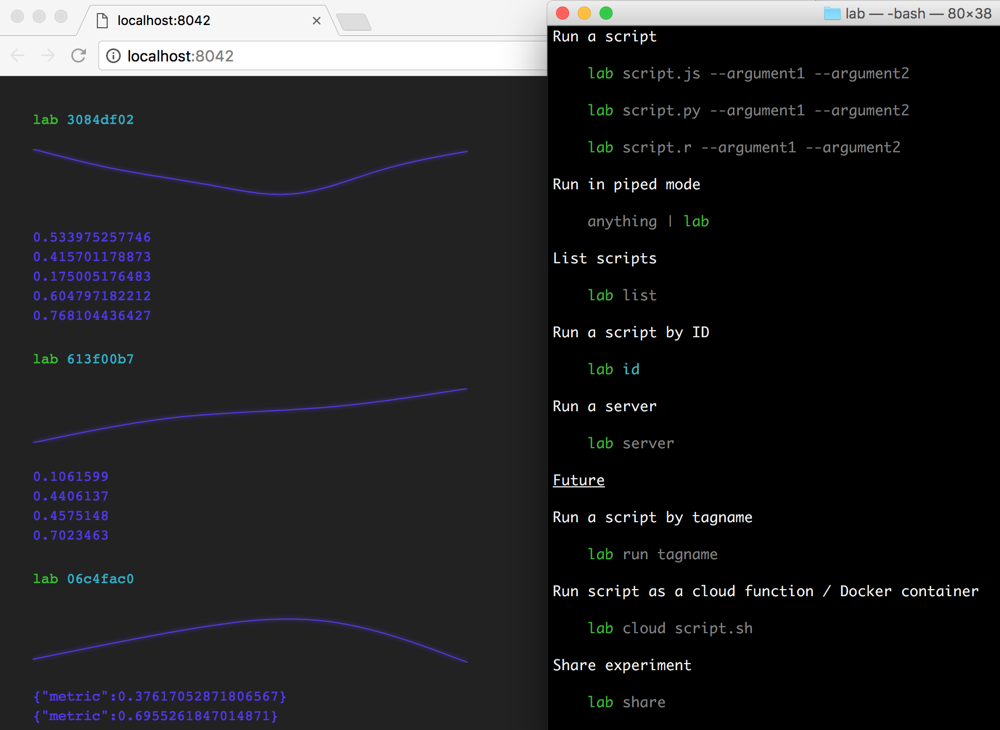

### About

CLI for data science

### Installation if you have Git and NodeJS installed

```sh
git clone https://github.com/kristjanjansen/lab
cd lab
npm install
npm run build
npm link
```
---

#### Run a script

```sh
lab script.js --argument1 --argument2
```

```sh
lab script.py --argument1 --argument2
```

```sh
lab script.r --argument1 --argument2
```

#### Run in piped mode

```sh
anything | lab
```

#### List scripts

```sh
lab list
```

#### Run a script by ID

```sh
lab id
```

#### Run a server

```sh
lab server
```

#### Deploy and connect to a remote server

```sh
npm i -g now
now kristjanjansen/lab
lab server http://now-address-in-clipboard.now.sh
```

## Future

#### Run a script by tag name

```sh
lab run tagname
```

#### Run script as a cloud function / Docker container

```sh
lab cloud script.sh
```

#### Stream local input data to local runner

```sh
cat inputdata | lab cloud script.sh
```

#### Stream local data to cloud runner

```sh
cat inputdata | lab cloud script.sh
```

#### Upload local data to cloud runner

```sh
lab cloud script.sh
```
...analyze the script input file usage...

```sh
# The script is using ./data.csv for input data
# Do you want to upload it?
# [Y/N]
```

#### Share an experiment

```sh
lab share
```